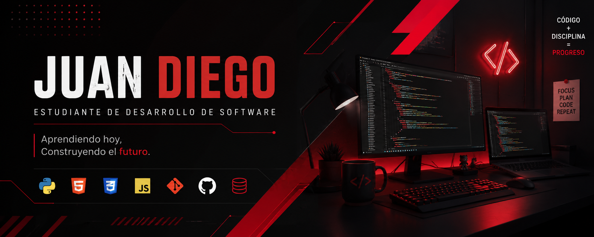

<div align="center">
  
</div>

<div align="center">
  <a href="https://juan-diego-dev.vercel.app/" target="_blank">
    
  </a>
  <a href="https://www.instagram.com/juanx_x112?igsh=MXVjeTJyeXIwbjV5dg==" target="_blank">
    
  </a>
  <a href="mailto:juandcortesa11@gmail.com" target="_blank">
    
  </a>
</div>

<br>

<h1 align="center">¡Hola! Soy Juan Diego 👋</h1>
<h3 align="center">Estudiante de Desarrollo de Software · Front-End enfocado en interfaces limpias y bien estructuradas</h3>

<p align="center">
  
</p>

---

### 💻 Sobre mí

Soy un estudiante de desarrollo de software en Colombia, apasionado por la programación, el desarrollo web y la tecnología en general.

- 🚀 Actualmente fortaleciendo mis habilidades en **JavaScript, SQL y desarrollo de APIs**
- 📚 Aprendo construyendo proyectos reales y explorando nuevas tecnologías constantemente
- 🎯 Mi objetivo es convertirme en **desarrollador Full Stack** y crear soluciones útiles, escalables y bien estructuradas
- 🌐 Puedes ver mi trabajo en mi **[portafolio personal](https://juan-diego-dev.vercel.app/)**

---

### 🛠️ Tecnologías y herramientas

<div align="left">
  
  
  
  
  
  
  
  
  
  
  
  
  
</div>

---

### 📈 Actualmente aprendiendo

```text
JavaScript        ████████████░░░░░░░░  60%
SQL                ██████░░░░░░░░░░░░░░  35%
Desarrollo de APIs ████░░░░░░░░░░░░░░░░  25%
Buenas prácticas   ████████░░░░░░░░░░░░  45%
```

---

### 🚀 Proyectos destacados

| Proyecto | Descripción | Stack |
|---|---|---|
| 🌐 **[Portafolio personal](https://juan-diego-dev.vercel.app/)** | Sitio web personal con mis proyectos, habilidades y datos de contacto | HTML · CSS · JavaScript |
| 🏘️ **Página JAC Quinta Oriental** | Sitio web para la Junta de Acción Comunal del barrio Quinta Oriental | HTML · CSS · JavaScript |
| 🎸 **Blog Los Prisioneros** | Blog temático dedicado a la banda chilena Los Prisioneros, con identidad visual propia | HTML · CSS |

> 📌 *Próximamente más proyectos a medida que avanzo en mi formación.*

---

### 📊 Mis estadísticas

<div align="center">
  
  
</div>

<div align="center">
  
</div>

---

### 🎯 Objetivos

- [ ] Dominar JavaScript moderno (ES6+) y trabajar con APIs REST
- [ ] Profundizar en bases de datos relacionales con SQL
- [ ] Construir proyectos full stack completos de principio a fin
- [ ] Contribuir a proyectos de código abierto
- [ ] Aprender un framework backend (Node.js / Express)

---

<div align="center">
  <i>💬 Siempre abierto a colaborar en proyectos y a seguir aprendiendo.</i>
  <br><br>
  <a href="mailto:juandcortesa11@gmail.com">📩 Escríbeme</a> ·
  <a href="https://juan-diego-dev.vercel.app/">🌐 Ver portafolio</a>
</div>
